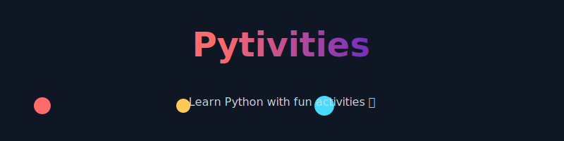

# 🐍 Python School Activities

- A small, friendly set of beginner Python exercises — copy, run, learn.

  

<p align="center">
  
  <br />
  <em>A collection of short, focused Python programs for learners 🎉</em>
</p>

---

## 📋 Table of Contents

- [🌟 Overview](#-overview)
- [🎯 Activities](#-activities)
- [🚀 Getting Started](#-getting-started)
- [📝 Code Examples](#-code-examples)
- [🤝 Contributing](#-contributing)
- [📄 License](#-license)

---

## 🌟 Overview

This repository contains **8 Python activities** perfect for beginners learning programming! Each activity demonstrates fundamental Python concepts in a simple, easy-to-understand way.

<div align="center">
  
</div>

---

## 🎯 Activities

| #   | Activity                | Description            | Concepts                   |
| --- | ----------------------- | ---------------------- | -------------------------- |
| 1️⃣  | **Hello World**         | First program ever!    | `print()` function         |
| 2️⃣  | **Add Two Numbers**     | Basic arithmetic       | Variables, `+` operator    |
| 3️⃣  | **User Input Addition** | Interactive program    | `input()`, type conversion |
| 4️⃣  | **Square Root**         | Calculate square root  | `**` operator, formatting  |
| 5️⃣  | **Complex Numbers**     | Math with complex nums | `cmath` module             |
| 6️⃣  | **Triangle Area**       | Heron's formula        | Math expressions           |
| 7️⃣  | **Quadratic Equation**  | Solve ax²+bx+c=0       | `cmath`, complex math      |
| 8️⃣  | **Swap Variables**      | Exchange values        | Temporary variables        |

---

## 🚀 Getting Started

### Prerequisites

- Python 3.x installed
- A code editor (VS Code, PyCharm, or any text editor)
- Enthusiasm to learn! 🎉

### How to Run

```bash
# Clone the repository
git clone https://github.com/LikeNmuFF/Pytivities.git

# Navigate to the folder
cd Pytivities

# Run any activity (example)
python Activity1.py
```

---

## 📝 Code Examples

### 🎬 Activity 1: Hello World

```python
print("Hello World!")
```

**Output:** `Hello World!`

---

### ➕ Activity 2: Add Two Numbers

```python
num1 = 1.5
num2 = 6.3
sum = num1 + num2
print('The sum of {0} and {1} is {2}'.format(num1, num2, sum))
```

**Output:** `The sum of 1.5 and 6.3 is 7.8`

---

### ⌨️ Activity 3: User Input Addition

```python
num2 = input("Enter first number: ")
num3 = input("Enter second number: ")
sum = float(num2) + float(num3)
print('The sum of {0} and {1} is {2}'.format(num2, num3, sum))
```

**Interactive!** Users can enter their own numbers.

---

### √ Activity 4: Square Root

```python
num = 8
num_sqrt = num ** 0.5
print('The square root of %0.3f is %0.3f' % (num, num_sqrt))
```

**Output:** `The square root of 8.000 is 2.828`

---

### 🔢 Activity 5: Complex Numbers

```python
import cmath
num = 1+2j
num_sqrt = cmath.sqrt(num)
print('The square root of {0} is {1:0.3f} + {2:0.3f}j'.format(num, num_sqrt.real, num_sqrt.imag))
```

**Output:** `The square root of (1+2j) is 1.272 + 0.786j`

---

### 🔺 Activity 6: Triangle Area

```python
a = 5
b = 6
c = 7
s = (a + b + c) / 2
area = (s*(s-a)*(s-b)*(s-c))**0.5
print('The area of the triangle is %0.2f' % area)
```

**Output:** `The area of the triangle is 14.70`

---

### 📈 Activity 7: Quadratic Equation

```python
import cmath
a = 1
b = 5
c = 6
d = (b**2) - (4*a*c)
sol1 = (-b-cmath.sqrt(d))/(2*a)
sol2 = (-b+cmath.sqrt(d))/(2*a)
print('The solution are {0} and {1}'.format(sol1, sol2))
```

**Output:** `The solution are (-3+0j) and (-2+0j)`

---

### 🔄 Activity 8: Swap Variables

```python
x = 5
y = 10
temp = x
x = y
y = temp
print('The value of x after swapping: {}'.format(x))
print('The value of y after swapping: {}'.format(y))
```

**Output:**

```
The value of x after swapping: 10
The value of y after swapping: 5
```

---

## 🎮 Run All Activities at Once

Copy all activities into one file and run (this script prints each exercise header then runs it):

```python
# Complete Python School Activities
# Copy and paste everything below!

# ACTIVITY 1
print("=" * 50)
print("ACTIVITY 1: Hello World")
print("=" * 50)
print("Hello World!")
print()

# ACTIVITY 2
print("=" * 50)
print("ACTIVITY 2: Add Two Numbers")
print("=" * 50)
num1 = 1.5
num2 = 6.3
sum = num1 + num2
print('The sum of {0} and {1} is {2}'.format(num1, num2, sum))
print()

# ACTIVITY 3
print("=" * 50)
print("ACTIVITY 3: User Input Addition")
print("=" * 50)
num2 = input("Enter first number: ")
num3 = input("Enter second number: ")
sum = float(num2) + float(num3)
print('The sum of {0} and {1} is {2}'.format(num2, num3, sum))
print()

# ACTIVITY 4
print("=" * 50)
print("ACTIVITY 4: Square Root")
print("=" * 50)
num = 8
num_sqrt = num ** 0.5
print('The square root of %0.3f is %0.3f' % (num, num_sqrt))
print()

# ACTIVITY 5
print("=" * 50)
print("ACTIVITY 5: Complex Numbers")
print("=" * 50)
import cmath
num = 1+2j
num_sqrt = cmath.sqrt(num)
print('The square root of {0} is {1:0.3f} + {2:0.3f}j'.format(num, num_sqrt.real, num_sqrt.imag))
print()

# ACTIVITY 6
print("=" * 50)
print("ACTIVITY 6: Triangle Area")
print("=" * 50)
a = 5
b = 6
c = 7
s = (a + b + c) / 2
area = (s*(s-a)*(s-b)*(s-c))**0.5
print('The area of the triangle is %0.2f' % area)
print()

# ACTIVITY 7
print("=" * 50)
print("ACTIVITY 7: Quadratic Equation")
print("=" * 50)
a = 1
b = 5
c = 6
d = (b**2) - (4*a*c)
sol1 = (-b-cmath.sqrt(d))/(2*a)
sol2 = (-b+cmath.sqrt(d))/(2*a)
print('The solution are {0} and {1}'.format(sol1, sol2))
print()

# ACTIVITY 8
print("=" * 50)
print("ACTIVITY 8: Swap Variables")
print("=" * 50)
x = 5
y = 10
temp = x
x = y
y = temp
print('The value of x after swapping: {}'.format(x))
print('The value of y after swapping: {}'.format(y))
print("=" * 50)
print("🎉 THANKS FOR LEARNING PYTHON! 🎉")
print("=" * 50)
```

---

## 📊 Learning Progress

```
Activity 1: [██████████] 100% - Hello World
Activity 2: [██████████] 100% - Adding Numbers
Activity 3: [██████████] 100% - User Input
Activity 4: [██████████] 100% - Square Root
Activity 5: [██████████] 100% - Complex Numbers
Activity 6: [██████████] 100% - Triangle Area
Activity 7: [██████████] 100% - Quadratic
Activity 8: [██████████] 100% - Swap Variables
```

---

## 🎓 What You'll Learn

✅ Basic `print()` statements  
✅ Variables and data types  
✅ User input handling  
✅ Mathematical operations  
✅ Using Python modules  
✅ String formatting  
✅ Problem-solving skills

---

<div align="center">
  <h2>🌟Happy Life - Happy Coding! 🌟</h2>
  
  
  [](https://github.com/yourusername)
  [](https://github.com/yourusername)
</div>
