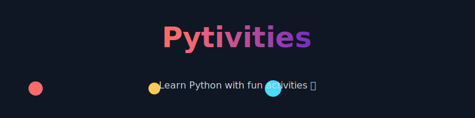

# 🐍 Python School Activities

A fun collection of **beginner-friendly Python exercises** for learning programming step-by-step.


<p align="center">
  
  <br>
  <em>A collection of short, focused Python programs for learners 🎉</em>
</p>

---

# ✨ Highlights

⭐ Beginner-friendly Python programs
⚡ Quick and easy to run
🎯 Perfect for classroom exercises
🧠 Learn programming through practice

---

# 📋 Table of Contents

- Overview
- Activities
- Getting Started
- Code Examples
- Learning Progress
- What You'll Learn

---

# 🌟 Overview

This repository contains **14 beginner Python activities** designed to teach basic programming concepts in a **simple and fun way**.

<div align="center">


</div>

---

# 🎯 Activities

| #   | Activity            | Description               | Concepts           |
| --- | ------------------- | ------------------------- | ------------------ |
| 1   | Hello World         | First Python program      | `print()`          |
| 2   | Add Two Numbers     | Basic arithmetic          | variables          |
| 3   | User Input Addition | Interactive program       | `input()`          |
| 4   | Square Root         | Calculate square root     | math operators     |
| 5   | Complex Numbers     | Math with complex numbers | `cmath`            |
| 6   | Triangle Area       | Heron's formula           | expressions        |
| 7   | Quadratic Equation  | Solve quadratic equation  | math               |
| 8   | Swap Variables      | Exchange values           | variables          |
| 9   | Random Number       | Generate random number    | `random`           |
| 10  | Kilometer to Miles  | Unit conversion           | arithmetic         |
| 11  | Access List Items   | Working with lists        | indexing           |
| 12  | List Comprehension  | Filter list values        | list comprehension |
| 13  | List Slicing        | Extract list section      | slicing            |
| 14  | Loop Through List   | Iterate list items        | `for` loop         |

---

# 🚀 Getting Started

## Requirements

- Python 3.x installed
- Code editor (VS Code, PyCharm, etc.)

## Run the project

```bash
git clone https://github.com/LikeNmuFF/Pytivities.git
cd Pytivities
python Activity1.py
```

---

# 📝 Code Examples

---

# 🎬 Activity 1 — Hello World

```python
print("Hello World!")
```

**Output**

```
Hello World!
```

---

# ➕ Activity 2 — Add Two Numbers

```python
num1 = 1.5
num2 = 6.3

sum = num1 + num2

print('The sum of {0} and {1} is {2}'.format(num1, num2, sum))
```

**Output**

```
The sum of 1.5 and 6.3 is 7.8
```

---

# ⌨️ Activity 3 — User Input Addition

```python
num1 = input("Enter first number: ")
num2 = input("Enter second number: ")

sum = float(num1) + float(num2)

print('The sum of {0} and {1} is {2}'.format(num1, num2, sum))
```

---

# √ Activity 4 — Square Root

```python
num = 8

num_sqrt = num ** 0.5

print('The square root of %0.3f is %0.3f' % (num, num_sqrt))
```

**Output**

```
The square root of 8.000 is 2.828
```

---

# 🔢 Activity 5 — Complex Numbers

```python
import cmath

num = 1 + 2j

num_sqrt = cmath.sqrt(num)

print('The square root of {0} is {1:0.3f} + {2:0.3f}j'.format(num, num_sqrt.real, num_sqrt.imag))
```

---

# 🔺 Activity 6 — Triangle Area

```python
a = 5
b = 6
c = 7

s = (a + b + c) / 2

area = (s*(s-a)*(s-b)*(s-c))**0.5

print('The area of the triangle is %0.2f' % area)
```

---

# 📈 Activity 7 — Quadratic Equation

```python
import cmath

a = 1
b = 5
c = 6

d = (b**2) - (4*a*c)

sol1 = (-b-cmath.sqrt(d))/(2*a)
sol2 = (-b+cmath.sqrt(d))/(2*a)

print('The solutions are {0} and {1}'.format(sol1, sol2))
```

---

# 🔄 Activity 8 — Swap Variables

```python
x = 5
y = 10

temp = x
x = y
y = temp

print('The value of x after swapping:', x)
print('The value of y after swapping:', y)
```

---

# 🎲 Activity 9 — Generate Random Number

```python
import random

print(random.randint(0, 9))
```

Example Output

```
5
```

---

# 📏 Activity 10 — Convert Kilometers to Miles

```python
kilometers = float(input("Enter value in kilometers: "))

conv_fac = 0.621371

miles = kilometers * conv_fac

print('%0.2f kilometers is equal to %0.2f miles' % (kilometers, miles))
```

Example Output

```
Enter value in kilometers: 3.5
3.50 kilometers is equal to 2.17 miles
```

---

# 📚 Activity 11 — Access List Items

```python
a = [10, 20, 30, 40, 50]

print(a[0])
print(a[-1])
```

Output

```
10
50
```

---

# ⚡ Activity 12 — List Comprehension

```python
a = [10, 20, 30, 40, 50]

b = [item for item in a if item > 20]

print(b)
```

Output

```
[30, 40, 50]
```

---

# ✂️ Activity 13 — List Slicing

```python
a = [10, 20, 30, 40, 50]

print(a[1:4])
```

Output

```
[20, 30, 40]
```

---

# 🔁 Activity 14 — Using Loop

```python
a = [10, 20, 30, 40, 50]

for item in a:
    print(item)
```

Output

```
10
20
30
40
50
```

---

# 📊 Learning Progress

```
Activity 1  ██████████ 100%
Activity 2  ██████████ 100%
Activity 3  ██████████ 100%
Activity 4  ██████████ 100%
Activity 5  ██████████ 100%
Activity 6  ██████████ 100%
Activity 7  ██████████ 100%
Activity 8  ██████████ 100%
Activity 9  ██████████ 100%
Activity 10 ██████████ 100%
Activity 11 ██████████ 100%
Activity 12 ██████████ 100%
Activity 13 ██████████ 100%
Activity 14 ██████████ 100%
```

---

# 🎓 What You'll Learn

By completing these activities you will learn:

✔ Python basics
✔ Variables and data types
✔ User input
✔ Mathematical operations
✔ Python modules
✔ Lists and indexing
✔ List comprehension
✔ List slicing
✔ Loops and iteration

---

<div align="center">

## 🌟 Happy Coding! 🌟


Made for **students learning Python** 🐍

</div>
